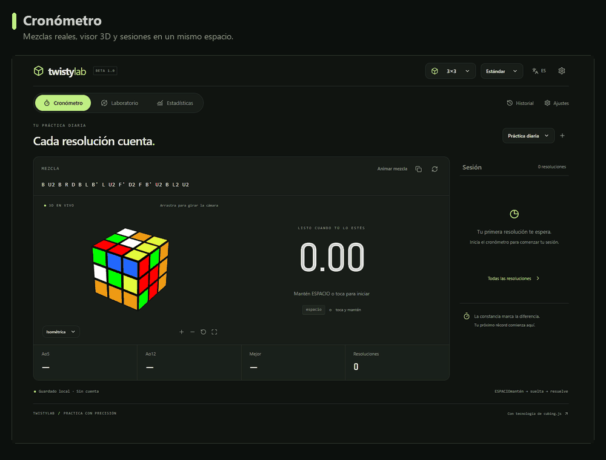
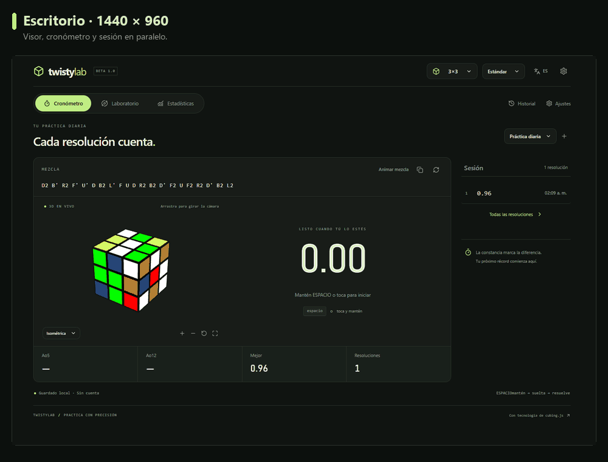
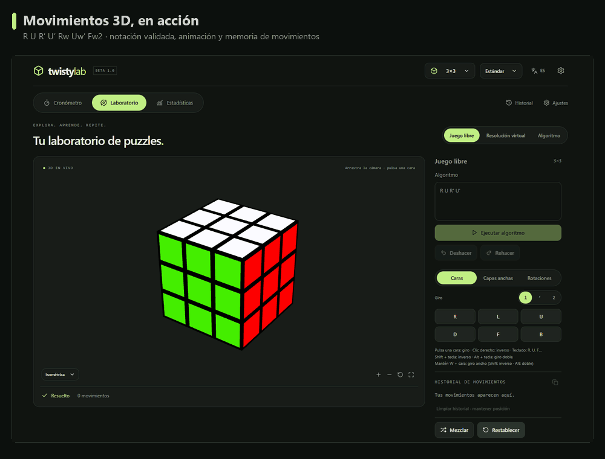

<div align="center">


# TwistyLab

### Practica. Explora. Encuentra tu ritmo.

Tu espacio de speedcubing: **cronómetro · puzzles 3D · resolución virtual · estadísticas**.

Sin cuenta. Tus sesiones se guardan en tu navegador.


[Vista previa](#vista-previa) · [Funciones](#lo-que-puedes-hacer) · [Puzzles](#elige-tu-puzzle) · [Empezar](#en-tu-equipo) · [Desarrollo](#para-desarrolladores)

</div>

---

## Vista previa

### Un recorrido por tu espacio de práctica

Del primer scramble al historial: prepara el cronómetro, guarda una resolución, revisa tus estadísticas y personaliza el espacio.



### Escritorio, tablet y móvil

Una distribución que aprovecha cada pantalla. En móvil, el visor se compacta, el editor y la guía se despliegan cuando los necesitas, y el catálogo mantiene su propio scroll.



**Pantallas del GIF:** escritorio **1440 × 960**, tablet **768 × 1024** y móvil **390 × 844**. La responsividad también se comprobó a 320 y 1024 px.

### Aprende viendo los movimientos

Ejecuta notación real, observa los giros y revisa el historial. Puedes usar el teclado, los controles táctiles o clics de cara cuando el puzzle los admite.



<sub>Los GIFs son capturas de la aplicación funcionando en Chromium. El tiempo mostrado pertenece a una sesión de demostración; no hay datos de ejemplo precargados en la app.</sub>

## Lo que puedes hacer

| Espacio                | Lo que encontrarás                                                                                                         |
| :--------------------- | :------------------------------------------------------------------------------------------------------------------------- |
| **Cronómetro**         | Space o pulsación táctil, preparación configurable, inspección de 15 segundos, +2/DNF y precisión de dos o tres decimales. |
| **Laboratorio 3D**     | Juego libre, algoritmos y resolución virtual. Órbita, zoom, vistas de cámara, fullscreen y reproducción paso a paso.       |
| **Resolución virtual** | Genera una mezcla y resuelve el modelo. El estado resuelto detiene el reloj y guarda tiempo, movimientos y TPS.            |
| **Tu progreso**        | Mo3, Ao5/Ao12/Ao25/Ao50/Ao100, mejores medias, récords por sesión y evento, y gráficas de tiempos.                         |
| **Historial**          | Sesiones independientes, notas, penalizaciones y reproducción del scramble de cada intento.                                |
| **A tu manera**        | Español/inglés, tema oscuro/claro/sistema, atajos editables y velocidad de animación.                                      |
| **Tus datos**          | Guardado local en IndexedDB, exportación CSV y copia JSON con importación validada.                                        |
| **Sin conexión**       | La PWA guarda los motores, puzzles y scramblers después de su primera carga de producción.                                 |

### Pequeños detalles que hacen más cómoda la práctica

- **Scrambles reales** de cubing.js, generados en sus workers.
- **Favoritos, recientes y búsqueda** para volver rápidamente a tu puzzle.
- **Filtros desplegables**, sin una fila interminable de categorías.
- **Inputs de altura fija con scroll interno**, controles propios y pestañas coherentes.
- **Undo/Redo**, copia de movimientos y limpieza del historial conservando la posición.
- **Preferencias persistentes**: idioma, apariencia, atajos, puzzle, modalidad y sesión.
- **Actualización de la PWA y recuperación del espacio** al cambiar de versión, conservando los solves guardados.

## Elige tu puzzle

| Familia              | Puzzles disponibles               |
| :------------------- | :-------------------------------- |
| **NxNxN**            | 2×2 · 3×3 · 4×4 · 5×5 · 6×6 · 7×7 |
| **Piramidales**      | Pyraminx · Master Pyraminx        |
| **Minx**             | Megaminx · Kilominx               |
| **Giro de esquinas** | Skewb · Redi Cube                 |
| **Otros retos**      | Square-1 · Clock · FTO · Baby FTO |

**16 puzzles**, con modelo lógico, representación 3D y generación de scrambles. Las modalidades de 3×3 incluyen estándar, una mano, blind, FMC y multi-blind; 4×4 y 5×5 también separan blind. Consulta los límites de estas modalidades más abajo.

## Tus dedos también tienen atajos

| Acción                           | Teclado                                    |
| :------------------------------- | :----------------------------------------- |
| Preparar e iniciar el cronómetro | Mantén **Space** hasta listo y suelta      |
| Detener y guardar el tiempo      | Pulsa **Space**                            |
| Girar una cara en el laboratorio | **R · L · U · D · F · B**                  |
| Giro inverso                     | **Shift + cara**                           |
| Giro doble                       | **Alt + cara**                             |
| Giro wide                        | Mantén **W + cara**                        |
| Wide inverso / doble             | **W + Shift + cara** / **W + Alt + cara**  |
| Capas centrales y rotaciones     | **M · E · S · X · Y · Z**, según el puzzle |

Por ejemplo: **W + R → Rw**, **W + Shift + L → Lw′**, **W + Alt + U → Uw2**. Los seis movimientos wide están disponibles: `Rw Lw Uw Dw Fw Bw`.

En pantallas táctiles puedes elegir **giro normal, inverso o doble** desde el panel. Los atajos del laboratorio se personalizan en **Ajustes → Controles** y se desactivan mientras escribes o usas un diálogo o selector.

## En tu equipo

Necesitas **Node.js 22.3 o superior**.

```sh
npm ci
npm run dev
```

Abre la URL que muestra Vite. El proyecto utiliza la base `/twistylab/`.

1. Elige un puzzle y una modalidad.
2. En **Cronómetro**, mantén Space o toca y mantén; suelta para empezar.
3. Detén el tiempo y revisa tu sesión, o entra al **Laboratorio** para explorar.
4. Personaliza idioma, apariencia e inspección desde **Ajustes**.

Para usar la distribución de producción local:

```sh
npm run build
node scripts/preview-subpath.mjs
```

Abre **[TwistyLab local](http://127.0.0.1:4173/twistylab/)**. Este enlace requiere el servidor local en ejecución.

## Para desarrolladores

**React 19 + TypeScript + Vite**, cubing.js y Three.js para los puzzles, Zustand para el estado, Dexie para persistencia y Workbox para la PWA.

| Comando                  | Para qué sirve                                  |
| :----------------------- | :---------------------------------------------- |
| `npm run dev`            | Desarrollo con Vite                             |
| `npm test`               | Pruebas de dominio, persistencia y controles    |
| `npm run lint`           | Revisión estática                               |
| `npm run build`          | Compilación TypeScript y distribución estática  |
| `npm run preview`        | Vista previa del build                          |
| `npm run verify:puzzles` | Scramble, KPuzzle e inversión de los 16 puzzles |

La última revisión incluye **58 pruebas aprobadas**, build y lint sin errores, comprobaciones en Chromium y una recarga de producción sin conexión. El detalle está en [VERIFICATION.md](VERIFICATION.md).

<details>
<summary><strong>Arquitectura y organización del proyecto</strong></summary>

## Arquitectura

| Carpeta                | Responsabilidad                                                 |
| ---------------------- | --------------------------------------------------------------- |
| `src/app`              | Shell, tabs y routing lazy                                      |
| `src/components`       | Selector, viewer, sesiones y componentes compartidos            |
| `src/features`         | Workspaces de timer, playground, stats, history y settings      |
| `src/core/puzzles`     | Registro central, modalidades y controlador interactivo         |
| `src/core/timer`       | Máquina de estados y cálculo de tiempo independiente de React   |
| `src/core/statistics`  | Medias, DNF/+2 y formato de tiempo                              |
| `src/core/storage`     | Esquema Dexie, repositorios, backup, validación e import/export |
| `src/core/controls`    | Chords de teclado y asignaciones por defecto                    |
| `src/core/scramble`    | Adaptador de scrambles oficiales de cubing.js                   |
| `src/engines/cubingjs` | Modelo lógico KPuzzle e historial independiente del renderer    |
| `src/engines/threejs`  | Adaptador 3D para Clock, Square-1 y Redi Cube                   |
| `src/stores`           | Stores separados de puzzle, timer, settings y sesión            |
| `src/workers`          | Cálculos de mejores medias fuera del hilo principal             |
| `src/test`             | Pruebas de dominio, persistencia, capacidades y controles React |

Los componentes acceden a IndexedDB a través de repositorios y stores. `InteractivePuzzleController` dirige el modelo de dominio; el renderer consume setup e historial. Los movimientos nativos de cubing.js se incorporan al mismo historial. Al desmontar se retiran listeners, se detiene playback/RAF y el adaptador Three.js libera geometrías, materiales y contexto WebGL.

</details>

<details>
<summary><strong>Cómo integrar un nuevo puzzle</strong></summary>

## Añadir un puzzle

1. Añade un `PuzzleDefinition` en `src/core/puzzles/registry.ts`, con categoría, ID de cubing.js, evento de scramble, capacidades y movimientos válidos.
2. Añade las `CompetitionMode` correspondientes sin duplicar el puzzle. Para nuevos scramblers, crea otro adaptador en `core/scramble`.
3. Usa `renderer: 'cubing'` siempre que exista un renderizador suficiente. Para un puzzle especial, implementa un adaptador de renderizado registrado, conservando `PuzzleEngine` como contrato del modelo.
4. Añade pruebas de carga, movimientos, inversión y solved. Comprueba export/import si añades datos al esquema.

La categorización ya contempla NxNxN, Minx, Pyramidal, Shape Mods, Cuboids, Corner Turning, Edge Turning, Experimental y Legacy. Los futuros puzzles no se presentan como disponibles hasta que tienen un motor funcional.

</details>

<details>
<summary><strong>Cómo se calculan las estadísticas</strong></summary>

## Matemática de las estadísticas

Se ordenan los últimos N tiempos efectivos y se descarta el `ceil(N × 0.05)` más rápido y más lento. +2 se suma antes del cálculo; DNF se representa como infinito, nunca como cero. Ao5 y Ao12 toleran un DNF, mientras que dos resultan en DNF. Mo3 no descarta extremos. Las medias se filtran por sesión, puzzle y modalidad. Los tiempos almacenados son milisegundos sin redondear; la visualización trunca a la precisión configurada.

</details>

## GitHub Pages

El contenido de esta carpeta debe ser la raíz del repositorio. El [workflow de despliegue](.github/workflows/deploy.yml) instala desde el lockfile, ejecuta tests, compila y publica `dist`.

1. Sube el proyecto a la rama `main`.
2. En **Settings → Pages → Build and deployment → Source**, elige **GitHub Actions**.
3. Ejecuta el workflow o haz push a `main`.

La base **`/twistylab/`** está configurada para este repositorio. Si cambias su nombre, actualiza `base` en [vite.config.ts](vite.config.ts). HashRouter usa `/#/timer`, `/#/playground`, `/#/stats`, `/#/history` y `/#/settings`, sin redirecciones del servidor. Los workers se resuelven como módulos de Vite y la PWA se mantiene dentro del scope del sitio.

## Alcance y límites

Los controles y modelos disponibles se pueden usar hoy. Algunas interacciones físicas y modalidades avanzadas tienen estas limitaciones:

<details>
<summary><strong>Ver límites de los renderizadores, modalidades y almacenamiento</strong></summary>

## Límites conocidos

- cubing.js expone interacción experimental por clic de cara y órbita; **arrastrar una capa directamente no está implementado**. Usa clics, teclado o el panel de movimientos. La interacción por clic depende del soporte de PuzzleGeometry de cada puzzle.
- Clock, Square-1 y Redi Cube no tienen renderer 3D nativo en la versión fijada. El adaptador Three.js usa el estado KPuzzle y meshes propios. Redi Cube representa sus 48 stickers orientados sobre una geometría estilizada de sus 20 piezas; el estado de colores es real, pero el giro mecánico de esquinas no se simula. Clock muestra diales y reverso; los pines son visuales, no un mecanismo físico editable. Square-1 representa wedges y cambios de forma, pero sus transiciones de slice son interpolaciones, no una simulación mecánica con colisiones o bloqueo de cortes ilegales.
- La detección solved usa cubing.js cuando existe y comparación de estado por defecto como alternativa. Clock comprueba todos los diales e ignora la orientación del marco. Algunas orientaciones globales de puzzles no cúbicos pueden necesitar volver a la orientación inicial.
- Las modalidades OH/blind/FMC/multi-blind se separan por evento y scramble; esta versión registra tiempos. No implementa puntuación de FMC, múltiples cubos ni flujo reglamentario completo de blind/multi-blind.
- Un algoritmo se valida antes de aplicarlo. Notación de cubing.js no equivale a validación de restricciones físicas de todos los puzzles especiales.
- La sesión y el historial sobreviven a recargas, pero el estado de Free Play se reinicia al salir del módulo. Exporta backups antes de limpiar datos del navegador.
- Un solve se considera terminado en el estado lógico del motor; la última animación puede seguir unos instantes después de detener el timer virtual.
- No hay sincronización entre dispositivos, hardware Stackmat/Bluetooth ni solver automático. Los navegadores pueden eliminar la caché o almacenamiento local por políticas de espacio; conserva backups.
- Los motores WebGL/WASM generan chunks grandes lazy. Es una advertencia de tamaño de Vite, no un fallo de build. La descarga inicial de la PWA incluye aproximadamente 3 MB sin comprimir de assets.

</details>

## Medios y referencias

Los GIFs están versionados en [`docs/media`](docs/media). Sus capturas originales de navegador se guardan en `output/readme-frames/` —una carpeta local ignorada por Git—. El encoder [`scripts/readme-gifs.py`](scripts/readme-gifs.py) vuelve a generar los medios desde esas capturas con Python y Pillow. Las capturas se realizaron con Playwright; no hay dependencias de estas herramientas en el runtime de la app.

[cubing.js](https://js.cubing.net/) · [TwistyPlayer](https://js.cubing.net/cubing/twisty/) · [Scrambles](https://js.cubing.net/cubing/scramble/)

---

<div align="center">

**Tu próximo récord empieza con la siguiente resolución.**

<sub>TwistyLab · Practice with precision.</sub>

</div>
